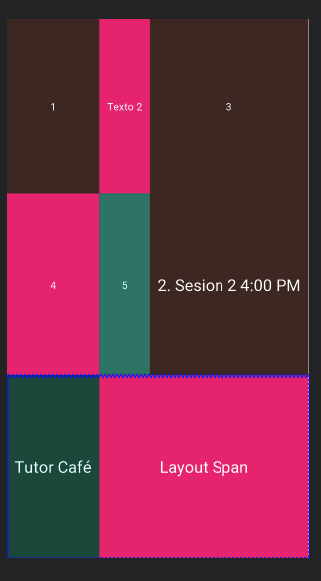

# Curso de android Next U

## Layouts
## Hay varios tipo de layouts en android
* Frame Layout
* Linear Layout
* Relative Layout
* Table Layout
* Grid Layout


### Linear layout
 
 

 Esto es un pequeño diseño haciendo uso de `LinearLayout` y de las propiedades de cada elemento hijo `layout_weight`, que actual con `flex`, *nota*: Simpre hay que especificar la altura o sino la aplicación tendrá un  error.

 ```xml
       <EditText
        android:layout_width="match_parent"
        android:layout_height="0dp"
        android:layout_weight="1"
        android:gravity="top"
        android:hint="@string/descripcion" 
      />
 ````


 ### Relative layout
 
 

 Este tipo de layout consiste en ubicar un elemento con respecto al otro por medio de su `@+id/` 

#### Algunos de los valores de elemplo son
1. `android:layout_centerInParent="true"` centra un elemento en centro de padre
1.  ` android:layout_above="id"` indica que un debe alinearse arriba del elemento con el `id` 
1.  ` android:layout_below="id"` indica que un debe alinearse debajo del elemento con el `id` 


## Table Layout


 


```xml 
<TableLayout 
    xmlns:android="http://schemas.android.com/apk/res/android"
    xmlns:tools="http://schemas.android.com/tools"
    android:layout_width="match_parent"
    android:layout_height="match_parent"
    android:stretchColumns="*"
    android:shrinkColumns="0,1,"
    tools:context=".MainActivity">
```

```xml 
<TableRow
    android:layout_weight="1"
  />
```
`android:layout_weight="1"` puede adicionarse para dar un tamaño a la fila 

`android:stretchColumns="0,1,2,..."` Esta propiedad la cantidad de spacio que puede tomar una columna dentro de la fila

`android:shrinkColumns="0,1,"` Indica las columnas que se pueden contraer

`android:layout_span="2"` Hace que una columna cresca el numero de columas faltantes


## Glosario

- `gravity`: Alinea el contenido de un elemento

 
