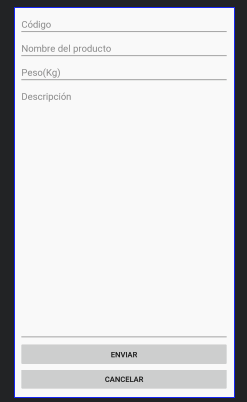

# Curso de android Next U

## Layouts

### Linear layout
 
 

 Esto es un pequeño diseño haciendo uso de `LinearLayout` y de las propiedades de cada elemento hijo `layout_weight`, que actual con `flex`, *nota*: Simpre hay que especificar la altura o sino la aplicación tendrá un  error.

 ```xml
       <EditText
        android:layout_width="match_parent"
        android:layout_height="0dp"
        android:layout_weight="1"
        android:gravity="top"
        android:hint="@string/descripcion" 
      />
 ````
 
