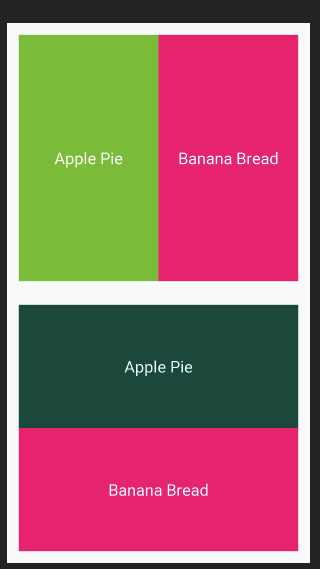

# Curso de android Next U

## Layouts
## Hay varios tipos de layouts en android
* Frame Layout
* Linear Layout
* Relative Layout
* Table Layout
* Grid Layout


### Linear layout
 
 

 Esto es un pequeño diseño haciendo uso de `LinearLayout` y de las propiedades de cada elemento hijo `layout_weight`, que actual con `flex`, *nota*: Simpre hay que especificar la altura o sino la aplicación tendrá un  error.

 ```xml
       <EditText
        android:layout_width="match_parent"
        android:layout_height="0dp"
        android:layout_weight="1"
        android:gravity="top"
        android:hint="@string/descripcion" 
      />
 ````


 ### Relative layout
 
 

 Este tipo de layout consiste en ubicar un elemento con respecto al otro por medio de su `@+id/` 

#### Algunos de los valores de elemplo son
1. `android:layout_centerInParent="true"` centra un elemento en centro de padre
1.  ` android:layout_above="id"` indica que un debe alinearse arriba del elemento con el `id` 
1.  ` android:layout_below="id"` indica que un debe alinearse debajo del elemento con el `id` 


## Table Layout


 


```xml 
<TableLayout 
    xmlns:android="http://schemas.android.com/apk/res/android"
    xmlns:tools="http://schemas.android.com/tools"
    android:layout_width="match_parent"
    android:layout_height="match_parent"
    android:stretchColumns="*"
    android:shrinkColumns="0,1,"
    tools:context=".MainActivity">
```

```xml 
<TableRow
    android:layout_weight="1"
  />
```
`android:layout_weight="1"` puede adicionarse para dar un tamaño a la fila 

`android:stretchColumns="0,1,2,..."` Esta propiedad la cantidad de spacio que puede tomar una columna dentro de la fila

`android:shrinkColumns="0,1,"` Indica las columnas que se pueden contraer

`android:layout_span="2"` Hace que una columna cresca el numero de columas faltantes


## Grid Layout

Ejercicio de codificación 1

 

Ejercicio de codificación 2

 


Se debe especificar el numero de columnas y filas que va a tener con `  android:columnCount="2"
    ` y  `android:layout_row="2"`

```xml
<GridLayout xmlns:android="http://schemas.android.com/apk/res/android"
    xmlns:tools="http://schemas.android.com/tools"
    android:layout_width="match_parent"
    android:layout_height="match_parent"
    android:columnCount="2"
    android:layout_row="2"
    tools:context=".MainActivity">
```

```xml 
<ImageView
  android:layout_columnSpan="2"
  android:layout_rowSpan="2" />
```
`android:layout_columnSpan="2"` indican la cantidad de espacio que pueden expandirse en direccion de las columnas

`android:layout_rowSpan="2" ` indican la cantidad de espacio que pueden expandirse en direccion de las filas


## Combinando layout
 


 ## Ejercicio de codificación 1
 


 ## Ejercicio de codificación 2
 


## Glosario

- `gravity`: Alinea el contenido de un elemento

 


# Activities

Son las ventanas con que el usuario interactua,compuesto por un `.xml` y `.java` .
> Todas deben ser registradas en `AndroidManifest`

## Ciclo de vida

 1. `onCreate` crea el activity, haciendo uso de `setContentView` para cargar la interfaz de usuario

```java 
 @Override
    protected void onCreate(Bundle savedInstanceState) {
        super.onCreate(savedInstanceState);
        setContentView(R.layout.activity_main);
        Log.wtf("Ciclo de vida","onCreate");

    }

  @Override
    protected void onStart() {
        super.onStart();
        Log.wtf("Ciclo de vida","onStart");
    }

    @Override
    protected void onResume() {
        super.onResume();
        Log.wtf("Ciclo de vida","onResume");
    }
    @Override
    protected void onPause() {
        super.onPause();
        Log.wtf("Ciclo de vida","onPause");
    }
    @Override
    protected void onStop() {
        super.onStop();
        Log.wtf("Ciclo de vida","onStop");
    }

    @Override
    protected void onDestroy() {
        super.onDestroy();
        Log.wtf("Ciclo de vida","onDestroy");
    }
```


### Para guardar el estado la aplicación cuando esta hace `onStop`

```java
@Override
    protected void onSaveInstanceState(Bundle outState) {
        super.onSaveInstanceState(outState);
        Log.wtf("Ciclo de vida","onSaveInstanceState");
        outState.putString(STATE_MESSAGE,mensaje.getText().toString());

    }

    @Override
    protected void onRestoreInstanceState(Bundle savedInstanceState) {
        super.onRestoreInstanceState(savedInstanceState);
        if(savedInstanceState!=null){
            mensaje.setText(savedInstanceState.getString(STATE_MESSAGE));
        }
    }
```


## Adptadores de ListaViews

Crea un puente entre la parte lógica y la interfaz gráfica
Mayormente usado en `GridView`,`ListView`
  